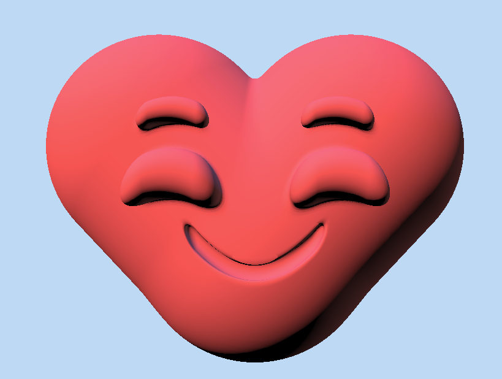
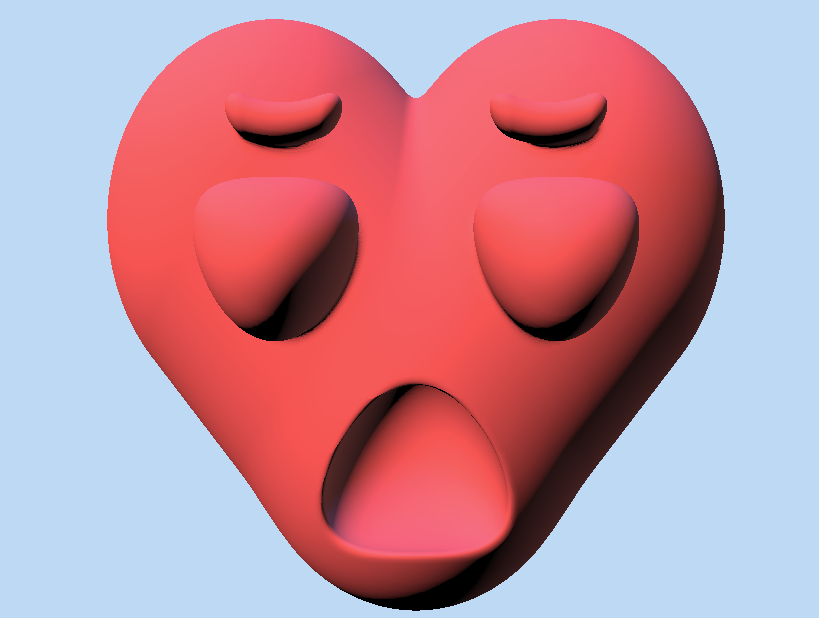
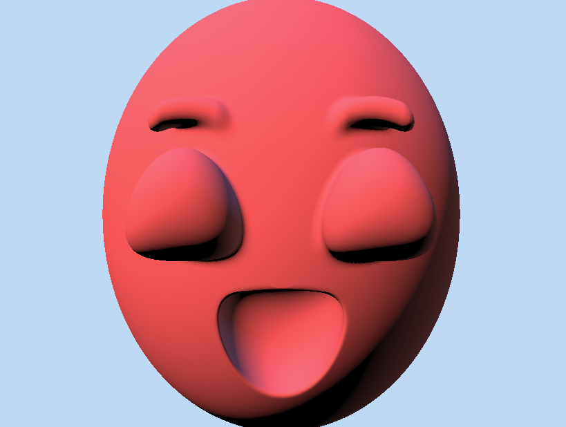
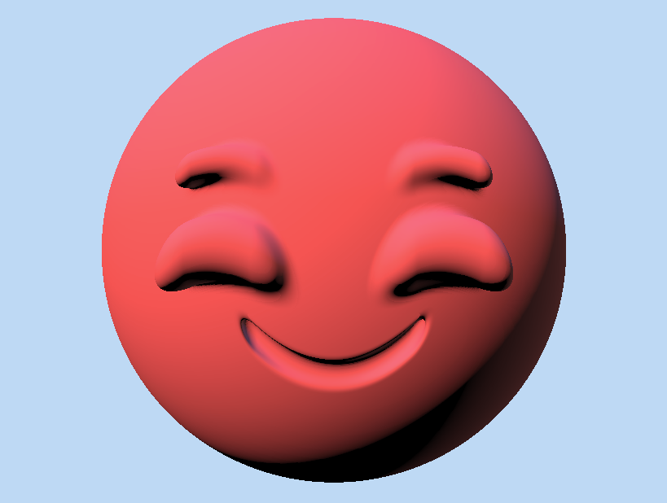
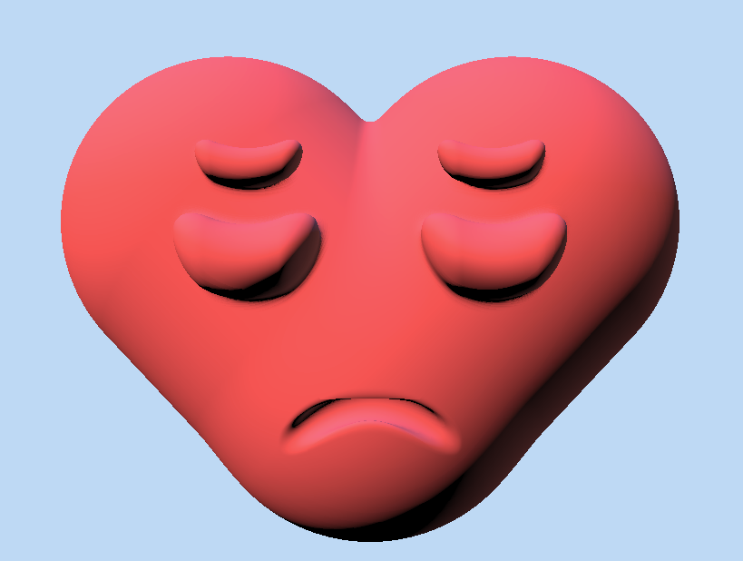
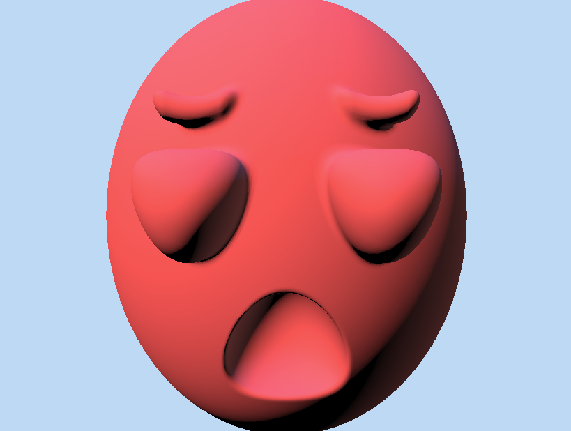
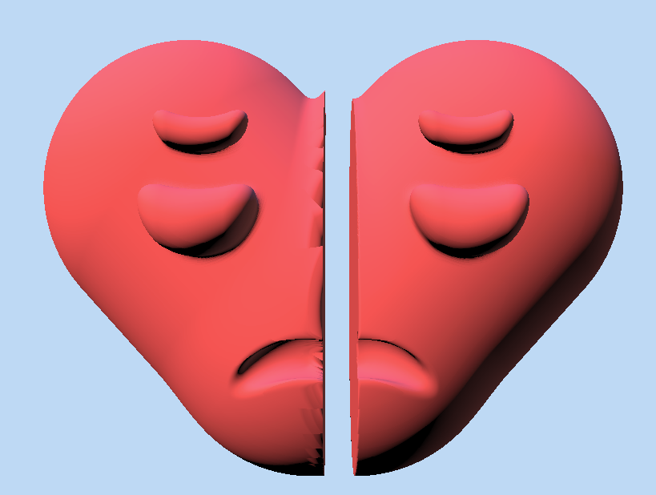

# Procedural Face Lab Submission - Nico Kong

I made 3 total parameters:
SURPRISE, SADNESS and HEART.

The animation in shadertoy will by default iterate over 6 combinations combinations each with some setting combination at their min/max.

Link to shadertoy repo: https://www.shadertoy.com/view/W32BDV

  
  
  
  
  
  

Me and classmate Aidan then made a second variant of this shader together, where the heart gets torn apart over time <code>&lt;/3</code>.

Link to Broken Heart version of this Lab: https://www.shadertoy.com/view/WX2BDV

# Assignment Description

Let's practice parameterization! We'll be starting with an oh-so-beautiful gingerbread man face that looks like this:

## Setup
Start by forking [this shadertoy](https://www.shadertoy.com/view/XftyR8)

## Task 1
In the faceSDF function, add a new float parameter called SUPRISE a value between 0 and 1. Copying the way EYE_SEPARATION is used, modify the face such that the gingerbread face looks more or less surprised based on the value of SURPRISE. SURPRISE = 0 should be not very surprised, and SUPRISE = 1.0 should look very surprised. Note that the face shouldn't look broken for any value in that range!
Changing this parameter should change at least 3 geometic attributes of the face and more than one facial feature (just eyebrows are NOT SUFFICIENT).

## Task 2
Your own parameter! Create a new attribute of your choice that maps to a procedural face characteristic in the domain of [0,1]. It SHOULD NOT be a literal attribute, eg. eye-separation or mouth size, but instead a more qualitative, subjective quality that you tie to specific geometic parameters using your design sense. Have fun!

## Extra Credit
In the faceSDF function, create a new float parameter called SADNESS. Follow the same guidelines as outlined in Task 1.
 
## Submission
- Create a pull request to this repository
- In the README, include the names of both your team members
- In the README, create a link to your shader toy solutions
- Make sure your shadertoy is set to UNLISTED or PUBLIC (so we can see them!)

